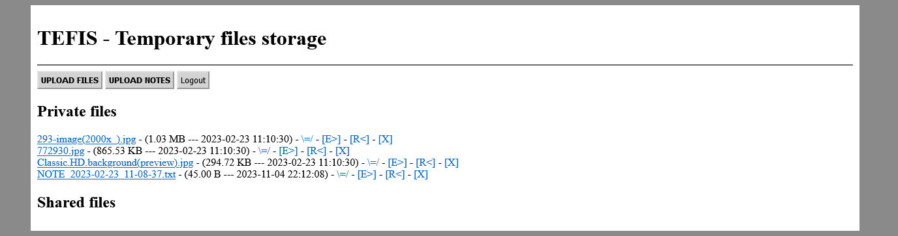

# TEFIS - Temporary files storage
Save files from someone else's computer without login to your important accounts.

## TEFISv2
This version is using PHP Sessions for user authentication. User doesn't have to login with each request.
 

## Installation
Copy this code to your secure web server and change default login details in file `index.php`.
